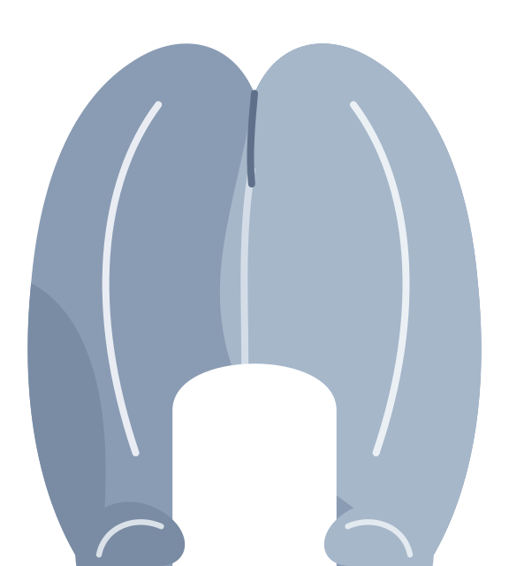

<p align="center">
  <picture>
    <source media="(prefers-color-scheme: dark)" srcset="assets/logo-dark.png">
    <source media="(prefers-color-scheme: light)" srcset="assets/logo-light.png">
    
  </picture>
</p>
<h1 align="center">patty</h1>
<p align="center">
  Finds leaked GitHub, Slack, AWS, Anthropic, OpenAI, container registry and Kubernetes credentials, and the keys that decrypt sops secrets, in every corner of a repository's history.<br>
  Marge's sister. Works at the DMV. Checks everyone's credentials.
</p>

---

A token that was committed once is in the repository forever -- even after the file was deleted, the commit amended, the branch force-pushed or the pull request closed. A normal clone does not show most of that history, and a scanner that walks `git log --all` never sees it. patty does: it mirrors the whole object database, pulls in what GitHub still holds but no ref points at anymore, and scans every object once.

It is fast enough to point at an entire organization. 210,000 objects and 6.7 GiB of content of [prometheus/prometheus](https://github.com/prometheus/prometheus) scan in about two seconds; the wall clock is the clone.

## Install

Download a binary from the [releases page](https://github.com/teemow/patty/releases) (Linux, macOS, Windows; amd64 and arm64), or build from source:

```bash
go install github.com/teemow/patty@latest
```

patty drives `git` on the command line, so git 2.30 or newer has to be on the `PATH`.

## Setup

For GitHub targets patty uses a token from `GITHUB_TOKEN`, `GH_TOKEN`, or the [gh CLI](https://cli.github.com/) (`gh auth token`), in that order. Without one it works anonymously: public repositories only, 60 API requests per hour.

**Classic token:** `repo` scope for private repositories, nothing for public ones.

**Fine-grained token:** select the repositories to scan, then grant:

| Permission | Access | Why |
|------------|--------|-----|
| Metadata | Read | List repositories, read sizes and the activity feed |
| Contents | Read | Clone private repositories |

**Anthropic and OpenAI keys:** their APIs cannot revoke a key by itself. To let `--revoke` deactivate a leaked Anthropic API key or delete a leaked OpenAI key, set `ANTHROPIC_ADMIN_KEY` to an [Admin API key](https://console.anthropic.com/settings/admin-keys) of the organization the leaked key belongs to, or `OPENAI_ADMIN_KEY` to an [admin key](https://platform.openai.com/settings/organization/admin-keys) of that organization. With one configured, `--verify` also names each key the way the Console does (name, workspace or project, creator), and `--revoke` deactivates only keys the organization's own key list confirms as its own; a key from another organization is reported as such. Without one, the report says where to revoke by hand. Detection and `--verify` need no admin key.

**Google Cloud:** the file `GOOGLE_APPLICATION_CREDENTIALS` names, `CLOUDSDK_AUTH_ACCESS_TOKEN`, and the credential files gcloud writes under `~/.config/gcloud` are read locally, so the report can say that a leaked service account key or refresh token is still configured on this machine; only fingerprints are compared, and gcloud's `credentials.db` is not opened. Revoking a Google OAuth token with `--revoke` signs out every tool that shares its grant, gcloud included.

The tokens patty finds never leave your machine unless you pass `--verify` or `--revoke`; see [what leaves your machine](docs/report.md#what-leaves-your-machine).

## Usage

```bash
patty .                          # the repository you are in, reflog and stashes included
patty acme/api acme/web          # two GitHub repositories
patty acme --verify              # everything acme owns; say which tokens are still live
patty acme --revoke              # ...and ask their providers to revoke the live ones, after confirmation
patty acme --json > leaks.json   # machine-readable report
```

A target is a local path, `owner/repo`, a github.com URL, or a bare `owner` (user or organization) to scan every repository of, private ones included when the token can see them. Exit code `0` means nothing was found, `1` that tokens were found, `2` that a target failed or was skipped and nothing was found.

`patty --help` lists every flag. The ones you will reach for:

- `--verify` -- ask GitHub, Slack, AWS, Google Cloud, Azure, Anthropic, OpenAI, the registries and the API servers named in kubeconfigs which credentials are still **active**; `--revoke` then revokes those, after asking (`--yes` skips the question). API servers on private networks are only contacted with [`--verify-private-servers`](docs/report.md#verifying-against-api-servers)
- `--ignore fp,fp` -- leave tokens you have already dealt with out of the report, by [fingerprint](docs/report.md#fingerprints) or by kind (`--ignore kubernetes-secret-manifest`)
- `--keep` -- keep mirrors in the cache so a re-run only fetches what changed; `--max-disk` and `--min-free` cap what the cache may use
- `--include-forks` -- include forks when expanding an owner

Other commands: `patty revoke` for tokens you already have in hand, `patty cache` and `patty cache clean` for kept mirrors, `patty self-update`.

## The report

```
2 credentials found (1 active) in 108 repositories, 82473 objects, 1.5 GiB

● ACTIVE     github-pat               ghp_2O6PWxYz…k3Lq  fp b492588d8d3ffbbb  user acme-bot, scopes: repo, workflow
    acme/dotfiles  .config/hub:4  2c10f8f4 2025-04-15 Jane Doe · initial commit
                   not on any branch or tag, only reachable through pull request refs: PR #1, PR #10, +11 more
    acme/lab       trials/run-7/messages.json:107  4048b6e8 2026-05-29 Jane Doe · record trial output
                   on main, +405 more
    ↳ revoke   at https://github.com/settings/tokens; or run again with --revoke
    ↳ local    still configured in ~/.config/hub; replace it there after revoking
    ↳ history  acme/dotfiles: only in pull request refs (GitHub Support has to purge those) · acme/lab: in branch history (rewrite with git filter-repo, then force-push)

● revoked    github-pat               ghp_jtP7Ab12…9zXy  fp 58b0d6ffe3821055
    acme/infra     cluster/apps/secret.sops.yaml:8  96a9ac2e 2026-01-05 Jane Doe · add training app
                   orphaned: no branch, tag or PR reaches this commit · force-pushed away from main on 2026-01-06 by jane
```

Each token is listed once with every place it was found, the oldest commit that introduced it, and how reachable that commit still is: on a branch, only through pull request refs, or orphaned by a force push. Active tokens come first, each with what to do about it: where to revoke it, whether it is still configured on this machine, and what its history needs. [Reading the report](docs/report.md) explains every line, [revoking](docs/report.md#revoking) and its side effects included.

## How it works

1. **Mirror, not clone.** `git clone --mirror` brings every ref GitHub advertises, including `refs/pull/*` and so the history of every pull request.
2. **Fetch what was rewritten.** The repository activity feed names the commits that were force-pushed away or deleted; GitHub still serves them by SHA, so patty fetches them too.
3. **Scan objects, not diffs.** Every blob, commit and tag in the object database is read exactly once, reachable or not, and checked for GitHub tokens, Slack tokens and webhooks, AWS access keys, Anthropic and OpenAI API keys, the registry logins in Docker configs and pull secrets (base64 layers included) and Docker Hub and Quay tokens, the client certificates, tokens and logins of kubeconfigs and Kubernetes service account tokens, and the age identities and PGP keys that decrypt sops secrets. The values of every Kubernetes Secret manifest are decoded and searched for all of them, and a Secret committed in the clear is reported on its own. Classic GitHub tokens and age identities are confirmed against their built-in checksum, so a lookalike in a test fixture is not reported; an AWS key id names the account it belongs to without asking AWS, and a sops identity comes with the list of encrypted files in the scanned repositories it opens.
4. **Attribute afterwards.** Only for objects that contain a token does patty look up the path, the introducing commit, and the refs that still contain it.

Mirrors live in a size-capped cache and are removed after the scan unless `--keep` is set, so pointing patty at an organization never fills a drive. [How patty works](docs/how-it-works.md) has the details, the token families it detects, and a [comparison with gitleaks](docs/how-it-works.md#compared-with-gitleaks).

## Development

```bash
make build          # Build the binary
make test           # Run tests (needs git on the PATH)
make lint           # Run golangci-lint
make help           # Show all available targets
```

Test tokens are constructed at runtime -- classic GitHub tokens from a random part plus a computed checksum, Slack tokens from their id groups and secret, AWS key ids from a prefix and a base32 body, Anthropic and OpenAI keys from a random body plus their fixed prefix, suffix or marker, Docker configs and pull secrets encoded on the fly, age identities and PGP keys freshly generated -- so no token-shaped string is committed to this repository.

## License

MIT -- see [LICENSE](LICENSE) for details.
